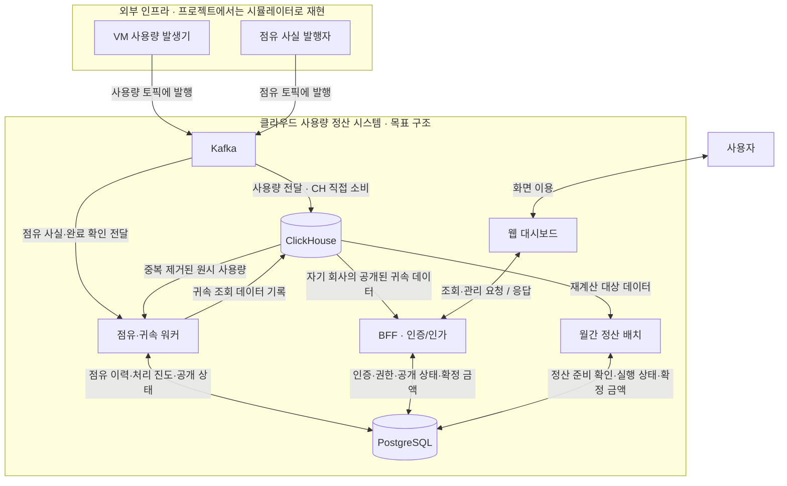

# 점유 이력·사용량 귀속 HLD

## 1. 상태와 범위

2026-09-25 워커 분리 승인, 2026-09-26 오류의 중단 전파 범위 승인. 워커는 [ADR-011](adr/0011-occupancy-attribution-worker.md)을 따른다. 계약·논리 모델은 HLD 기준안이며 LLD·구현·테스트 통과를 뜻하지 않는다.

목표는 **원시 사용량을 보존하면서, 확인된 과거 점유 회사에만 공개하는 것**이다. 기존 [공개 계약](occupancy-attribution-contract.md)을 실행·연결·데이터 소유권으로 구체화한다. VM 제어, 원시 적재, 가격 계산과 월간 확정의 책임은 바꾸지 않는다.

## 2. 실행 구조와 선택 근거

점유 이력과 사용량 귀속을 **하나의 백그라운드 워커 안의 두 모듈**로 둔다. 워커는 HTTP 사용자 요청과 무관하게 계속 처리한다. 캐시는 점유 이력 모듈 내부의 재생성 가능한 사본이며 제품·배포 형태는 LLD에서 정한다.

| 선택지 | 판단 |
|---|---|
| BFF에 포함 | 프로세스는 적지만 원시 데이터 접근 권한과 소비·재처리 부하가 사용자 API 프로세스에 들어간다. 기존 BFF 접근 경계와 맞지 않는다. |
| 월간 배치에 포함 | 프로세스는 적지만 상시 귀속과 월간 대량 작업의 실행·장애 수명이 결합된다. |
| 워커 하나로 분리 — 승인 | BFF·월간 배치와 재시작·권한·처리량을 분리한다. 배포·관측 대상 하나가 늘고, 워커 내부 두 모듈의 장애는 공유한다. |

두 모듈을 각각 서비스로 분리하지 않는다. 기존 Kafka→ClickHouse 직접 적재는 유지한다. 워커는 Kafka 사용량 토픽을 다시 소비하는 적재기가 아니라 **저장된 사용량을 회사에 귀속하는 처리자**다. 공유 DB의 자원 경합까지 프로세스 분리로 해결되지는 않으므로 읽기·쓰기 묶음과 동시 작업 수를 제한한다.

### 하이레벨 토폴로지 — 워커 분리 승인

상자는 외부 시스템·실행 단위·저장소이며 내부 모듈·테이블·복제 수는 펼치지 않는다. 화살표는 표시한 데이터 전달·읽기/쓰기 관계이며 호출 순서를 뜻하지 않는다. 승인된 목표 구조이며 모두 구현됐다는 뜻은 아니다.

Kafka와 각 DB는 하나씩만 표시했다. 두 종류의 토픽은 같은 Kafka 클러스터를 사용하며, 원시 사용량과 귀속 조회 데이터도 같은 ClickHouse의 서로 다른 데이터다. BFF는 원시 사용량을 읽지 않는다. 캐시는 워커의 점유 이력 책임 안에 있으며 별도 캐시 서버 도입은 아직 결정하지 않았다.

사용량은 기존 경로로 먼저 저장된다. 워커는 별도 점유 흐름으로 이력의 확인 범위를 갱신하고 저장된 사용량을 귀속한다. BFF·배치는 워커에 동기 호출하지 않고 저장소의 공개·준비 상태와 데이터를 읽는다. 따라서 워커 중단이 곧 API 중단은 아니지만, 미확인 구간의 공개·월간 확정은 기다린다. 조회 개정의 일치와 DB 간 경합 방어는 LLD 검증 대상이다.

워커 분리는 [C2](diagrams/c2-containers.svg)에도 반영했다. 가격 동기화와 운영 알림의 세부 연결은 이번 귀속 토폴로지에서 생략했다.

## 3. 경계별 계약

필드는 논리적 의미이며 JSON 이름·SQL 타입·메서드 서명이 아니다.

| 연결 | 입력·출력과 보장 |
|---|---|
| 외부 → 점유 이력 | VM 출처, 사건 ID, VM별 연속 번호, 점유 ID, 종류, 실제 발생 시각. 시작에는 회사 식별, 초기 등록에는 기준 시각·초기 상태, 완료 확인에는 확인 시각이 필요하다. 재전송은 동일 식별·내용을 유지한다. |
| 점유 이력 → 귀속 | VM·사용 구간을 받아 이력 버전·확인 범위와 점유 구간을 반환한다. 상태는 확인 부족 / 확인 완료 / 이력 모순으로 구분한다. 이력과 확인 범위는 동일 버전이며 호출자가 캐시를 직접 수정하지 않는다. |
| 원시 원장 → 귀속 | `source + id`, 사용 구간, 측정값을 중복 제거해 읽는다. 업무 발생 시각만으로 새 입력을 찾지 않는다. 적재 지연·재전송에도 빠짐없이 발견하고 재개할 수 있어야 한다. |
| 귀속 → 조회 모델 | 원시 이벤트 식별, 귀속 회사·점유 ID·이력 버전, 사용 구간·측정값, 공개 개정을 기록한다. 같은 원본은 활성 개정에서 한 회사에만 속한다. 가격 계산·선집계는 하지 않는다. |
| 귀속 → BFF | 공개 가능한 범위·개정만 조회한다. BFF는 현재 사용자 회사·역할을 검증하고 해당 회사의 DB 신원으로 접근한다. 원시 데이터 접근은 계속 금지한다. |
| 귀속 → 월간 배치 | 대상 월의 처리 범위, 대기·오류·정정 유무와 사용한 개정을 제공한다. 검증되지 않은 상태는 확정 불가다. Kafka lag 0만으로 준비 완료를 판단하지 않는다. |

사용량은 회사 중립을 유지한다. 외부 회사 식별과 내부 회사의 연결은 등록된 관계만 허용하며, 알 수 없는 회사는 자동 생성하지 않고 오류로 보존한다.

## 4. 논리 데이터 모델과 소유권

| 데이터 | 식별·관계 | 저장소 / 유일한 변경 책임 |
|---|---|---|
| VM 이력 기준 | VM 출처 → 등록 기준 시각·초기 상태 | PostgreSQL / 점유 이력 |
| 점유 구간 | 점유 ID → VM·회사·시작·종료·이력 버전. VM 하나에 시간상 여러 점유, 한 시점에는 최대 하나 | PostgreSQL / 점유 이력 |
| 사실 반영 기록 | VM·연속 번호 → 사건 ID·내용 식별·반영 상태 | PostgreSQL / 점유 이력 |
| 이력 확인 상태 | VM → 연속 반영 위치·확인 완료 시각·이력 버전 | PostgreSQL / 점유 이력 |
| 귀속 처리 단위 | 처리 ID → 입력 범위·발견/처리 진도·재시도 상태. 대기 항목은 원시 이벤트를 참조 | PostgreSQL / 사용량 귀속 |
| 귀속 오류 | 오류 ID → 원시 이벤트·VM·영향 구간·관련 귀속·사유·처리 상태·담당자 조치·해결 이력. 회사 불명도 표현 가능 | PostgreSQL / 사용량 귀속 |
| 공개 상태 | 영향 범위·개정 → 준비/공개/차단/대체 상태, 근거 이력 버전 | PostgreSQL / 사용량 귀속 |
| 귀속 조회 데이터 | 원시 이벤트·공개 개정 → 회사·점유·측정값 | ClickHouse / 사용량 귀속 |

원시 이벤트 하나에 재처리·정정 이력은 여러 개일 수 있지만, **조회에 유효한 귀속은 하나**다. 귀속 조회 데이터는 원본의 사본이며 원시 원장을 수정하지 않는다. PostgreSQL은 처리·공개 여부의 기준이고 ClickHouse는 조회 데이터의 저장소다. 공개 상태의 구체적 단위와 조회 강제 방식은 LLD에서 정한다.

## 5. 실행·실패·복구 경계

점유 소비 루프는 Kafka에서 사실을 받아 원장·캐시·처리 결과를 반영한 뒤 offset을 진행한다. 귀속 루프는 별도로 원시 원장을 제한된 묶음으로 읽고 확인된 이력으로 처리한다. 완료 확인 반영 시 대기 작업을 다시 시도하며, 재시작 때도 영속 상태에서 재개한다. 메모리 알림만을 재처리 근거로 삼지 않는다.

귀속 처리 순서는 **작업 기록 → 조회 데이터 준비 → 저장 결과 검증 → 공개 가능 상태 반영 → 처리 완료**다. 두 DB를 하나의 트랜잭션으로 간주하지 않는다. ClickHouse 쓰기 응답 유실·중복 쓰기·PostgreSQL 상태 반영 실패는 작업 식별과 개정으로 재시도하며, 준비 중 데이터는 조회에 포함하지 않는다.

정정은 **영향 범위 차단 → 진행 중 공개와의 경합 정리 → 이력·귀속 재작성 → 검증 → 새 개정 공개**로 진행한다. 기존 개정과 새 개정을 함께 노출하지 않는다. 차단 상태 확인 실패도 허용으로 해석하지 않는다. 이 순서를 BFF의 실제 조회와 DB 정책에서 강제할 수 있는지는 LLD·연결 테스트로 증명해야 한다.

워커가 멈추면 원시 수집은 계속하고, 정상적으로 공개된 기존 범위는 조회할 수 있다. 정정 차단 범위는 예외다. 확인 부족·귀속 오류·정정 중인 구간을 0원으로 대체하지 않는다.

### 귀속 오류의 국소 보류와 사람 개입

보류 단위는 **영향받는 VM·사용 구간과 관련 귀속**이다. 회사 불명이라는 이유만으로 모든 회사·월 작업을 중단하지 않는다. 무관한 사용량의 계산·검증·결과 보존은 계속한다. 회사 전체 일괄 중단도 기본 정책으로 삼지 않는다.

워커는 원본·오류·영향 범위를 보존하고 시스템 알림을 발행한다. 알림에는 오류 식별자, VM, 구간, 사유와 알려진 관련 귀속을 포함한다. 권한 있는 운영자가 이력을 확인·정정하면 같은 범위를 재처리하고, 검증 성공 후에만 보류를 해제한다. 알림 확인만으로 오류를 해결 처리하지 않으며 조치자를 기록한다. 미해결 원본을 자동 폐기하거나 임의 회사 귀속·0원·손실로 처리하지 않는다. 자동 보상·추가 청구는 이번 목표에서 제외한다.

**부분 처리 완료와 회사·월 전체 금액 확정은 다르다.** 영향 범위가 포함된 월 합계는 보류분이 남았음을 표시하며 완전한 확정액으로 내보내지 않는다. 회사 자체가 불명이면 전역 정산을 정지시키지 않고 범위 오류로 남겨 운영자가 관계를 확인한다. 이때 모든 회사 월 합계의 완전성이 증명됐다고 주장하지 않는다. 부분 결과와 전체 확정의 상태·API 표현은 정산 LLD에서 구분한다.

## 6. 가드레일과 LLD 진입 조건

- 구조: BFF는 원시 원장 접근 불가, 귀속 모듈은 점유 원장 변경 불가. 워커용 최소 권한을 분리한다.
- 연결: 두 입력의 역순 도착·중복·중간 장애·재시작에도 누락과 이중 공개가 없어야 한다.
- 조회: 준비/차단/대체된 개정, 타사 행은 실제 BFF 경로에서 읽히지 않아야 한다.
- 운영: 점유 소비 적체, 확인 시각 지연, 가장 오래된 귀속 대기, 오류 수, 정산 보류를 관측한다. 사용량의 최대 발생 시각을 완전성으로 표시하지 않는다.

워커 분리와 VM·구간·관련 귀속 단위의 보류를 승인했다. 다음은 LLD다. 정확한 스키마·키·트랜잭션, 누락 없는 원장 탐색, 동일 버전 읽기, 다중 워커 작업 소유권, 공개 개정의 조회 강제와 정정 경합을 설계하고 테스트 판정 기준을 고정한다. 공개 안전성을 구현할 수 없는 안은 HLD로 돌아가 수정한다.
