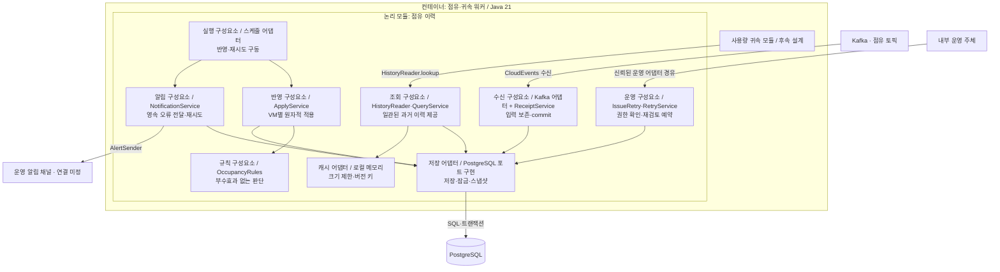

# 점유 이력: C3와 코드 설계

## 1. 결론·범위

구현자 참고 문서. **서비스는 실행·트랜잭션을 조율하고, 순수 규칙은 상태 전이를 판단하며, 어댑터는 외부 기술을 담당한다.** [LLD](occupancy-history-lld.md)의 승인된 수신함·원자적 반영·버전 캐시를 유지한다. 사용자 감독 경계는 C3이며 아래 C4 파일·코드는 에이전트가 구체화하는 표현안이다. 파일별 재승인 대상은 아니다. 이후 구현·컴파일·검증을 마쳤으며 아래 파일명·의사코드는 설계 당시 설명안이다. 실제 타입 배치는 [워커 코드](../apps/occupancy-worker/src/main/java/io/github/bbororo5/cloudbilling/worker/occupancyhistory)를 따른다. 구현 순서·미완료 범위는 [인계 문서](occupancy-history-implementation-plan.md)를 따른다.

C3는 점유·귀속 워커 하나를 확대한다. 귀속 모듈은 위치만 표시하고 이번에는 점유 이력 구성요소를 상세화한다. 파일·메서드는 C3보다 아래 코드 수준이므로 별도로 제시한다.

## 2. C3 — 구성요소와 협력



화살표는 주요 호출 관계다. 저장 포트는 실제 호출 때 어댑터를 사용하지만 **소스 코드에서는 서비스가 포트 인터페이스에만 의존**한다. 서비스→SQL 구현의 직접 import를 허용하는 그림이 아니다. 로컬 캐시는 별도 컨테이너가 아니며 수신과 반영은 같은 프로세스의 독립 실행 흐름이다.

## 3. 전략의 이유와 패턴 선택

### 전략: I/O와 판단을 분리한다

점유 종료 규칙을 확인할 때 Kafka·DB까지 실행해야 한다면 작은 규칙 변경도 검증이 비싸진다. 따라서 저장소에서 읽은 불변 상태와 사건을 규칙에 전달하고, 규칙은 ‘이렇게 변경 가능 / 대기 / 오류’를 값으로 반환한다. **테스트는 반환된 판단을 직접 검사하고, DB 테스트는 그 판단이 원자적으로 저장되는지만 검사**한다.

이 구조는 헥사고날의 내부/외부 의존 분리와, 서비스가 작업을 조율하는 접근을 사용한다. 순수 규칙 함수 자체가 Strategy나 State 패턴인 것은 아니다. 도메인 규칙은 domain에 남고 서비스에 업무 조건문을 흩뿌리지 않는다.

| 코드 문제 | 선택과 적용 파일 | 선택 이유·재검토 조건 |
|---|---|---|
| 사건별 동작 | `OccupancyRules.decide`의 명시적 switch + private 함수 | 네 종류가 같은 이력·불변식을 공유한다. 고객별 알고리즘 교체가 없으므로 Strategy 등록·선택 계층은 불필요. 독립적인 정책 교체가 생기면 재검토 |
| 상태 전이 | 불변 `HistoryState` + `ApplyDecision` | 현재 상태를 몰래 수정하지 않아 전후 비교가 쉽다. State 객체마다 저장·전이 권한을 분산시키지 않음. 상태별 동작이 커지면 재검토 |
| 입력 생성 | `TimeRange`·사건 record의 검증 생성자, `EventDecoder` | 값 자체의 제약은 생성 시, 기존 이력과의 관계는 규칙에서 검사. Factory 계층이나 Builder는 필요하지 않음 |
| 공통 처리 순서 | `ApplyService`의 명시적 조율과 생성자 주입 | 상속 훅보다 잠금→판단→저장이 한눈에 보임. Template Method를 도입하지 않음 |
| 외부 저장·캐시 | 목적별 포트와 구체 어댑터 | 테스트 대체·SQL 경계는 필요하나 각 클래스마다 인터페이스를 만들지 않음 |

## 4. 파일과 메서드 배치

제안 위치는 `apps/occupancy-worker/src/main/java/io/github/bbororo5/cloudbilling/worker/occupancyhistory/`다. 해당 Gradle 모듈을 추가했다. 표의 중괄호는 파일 묶음 표기다.

| 패키지 / 파일 | 구체적인 논리 단위 |
|---|---|
| `api/HistoryReader.java` | `lookup(HistoryQuery): HistoryResult` — 귀속 모듈의 유일한 이력 조회 입구 |
| `api/{HistoryQuery,TimeRange,HistoryResult,HistorySnapshot}.java` | 불변 입력·결과. 결과별 record는 sealed 결과 안에 중첩. snapshot 목록은 방어적 복사 |
| `api/{IssueRetry,RetryIssueCommand,RetryResult}.java` | 운영 재시도 계약. 고객 권한과 분리된 신뢰 문맥은 운영 경계에서 제공 |
| `application/ReceiptService.java` | `receive(ReceivedRecord)` — 원문·정규 사건 또는 오류를 함께 보존 |
| `application/ApplyService.java` | `applyNext(VmSource)` — VM 잠금·다음 사건 조회·규칙 호출·변경 저장 |
| `application/QueryService.java` | HistoryReader 구현. DB 버전·issue 확인 후 캐시 또는 같은 스냅샷의 이력 조회 |
| `application/RetryService.java` | IssueRetry 구현. 운영 권한·requestId 확인, 재시도 예약·감사 기록 |
| `application/NotificationService.java` | `deliverPending(limit)` — 미전달 오류 조회·트랜잭션 밖 전송·결과 기록 |
| `domain/OccupancyEvent.java` | sealed 사건 + Initialized/Started/Ended/Confirmed 불변 record |
| `domain/{HistoryState,ApplyDecision,HistoryChange}.java` | 잠금 아래 읽은 규칙 입력, 판단 결과, 저장할 변경안. Kafka·SQL 타입 없음 |
| `domain/OccupancyRules.java` | `decide(state,event)` 및 사건별 private 함수. 시계·I/O 없음 |
| `port/{ReceiptStore,HistoryStore,SnapshotStore,IssueStore}.java` | 목적별 저장 계약. HistoryStore는 `lockAndLoadNext(source)`, `persist(source,decision)` 제공 |
| `port/{TransactionRunner,SnapshotCache,AlertSender}.java` | 쓰기/일관된 읽기 경계, 버전별 캐시, 알림 전달 |
| `adapter/kafka/{OccupancyConsumer,EventDecoder}.java` | KafkaRecord→내부 입력 변환·스키마 검사·수신 서비스 호출·commit |
| `adapter/postgres/Postgres*Store.java` | 포트별 SQL·행 매핑·제약 위반 분류. 동일 트랜잭션 연결 사용 |
| `adapter/postgres/PostgresTransactionRunner.java` | 트랜잭션 시작/commit/rollback과 읽기 격리 수준 적용 |
| `adapter/cache/LocalSnapshotCache.java` | 불변 키·값, 최대 크기, eviction. 최신성 판단은 QueryService 책임 |
| `adapter/scheduling/OccupancyJobs.java` | 제한된 묶음·재시도 주기 실행. 열린 트랜잭션에서 sleep 금지 |

워커 구성 지점이 생성자 주입으로 조립한다. Java 접근 제한만으로 모든 패키지 경계를 보장한다고 주장하지 않으며 구조 테스트에서 `귀속→api만`, `domain→JDK만`, `application→adapter 금지`를 검사한다. 표의 포트에서 사용하는 내부 DTO는 port/domain에 두고 공개 API 타입과 서비스에서 변환한다. 공개 API가 domain을 역참조하지 않게 한다.

`EventDecoder`는 wire 형식을 해석할 뿐 점유의 정당성을 결정하지 않는다. 해석 실패도 ReceiptService가 원문·오류로 내구 보존한다. Kafka 라이브러리의 객체를 공개 API로 흘려보내지 않는다.

## 5. 대표 코드 형태 — 점유 종료

아래는 **설명용 의사코드**이며 컴파일 가능한 구현이나 테스트 통과 코드가 아니다. 저장 예외·재시도 분기는 기존 LLD의 실패 계약을 따른다.

```java
// domain/OccupancyRules.java
ApplyDecision decide(HistoryState state, OccupancyEvent event) {
    // 공통: 초기화·예상 번호·확인된 과거 변경 금지를 먼저 검사
    return switch (event) {
        case Initialized e -> initialize(state, e);
        case Started e     -> start(state, e);
        case Ended e       -> end(state, e);
        case Confirmed e   -> confirm(state, e);
    };
}

private ApplyDecision end(HistoryState state, Ended event) {
    // 대상 점유 존재, 아직 종료되지 않음, 시작 < 종료 검사
    // 점유 ID가 다르면 현재 점유를 대신 종료하지 않음
    return new ApplyDecision.Apply(
        new HistoryChange.CloseInterval(event.occupancyId(), event.time()));
}
```

규칙이 받는 HistoryState는 해당 사건 판단에 필요한 현재 구간·대상 구간·이력 기준·진도다. VM의 전체 평생 이력을 매번 로딩하지 않는다. 연속 번호·사건 시간만으로 과거 중첩을 전부 검사할 수 있다고 가정하지 않으며 DB exclusion 제약이 최종 방어를 맡는다.

```java
// application/ApplyService.java
ApplyResult applyNext(VmSource source) {
    return transactions.write(() -> {
        var input = historyStore.lockAndLoadNext(source);
        if (input.isEmpty()) return ApplyResult.idle();
        var decision = rules.decide(input.state(), input.event());
        return historyStore.persist(source, decision);
        // Apply: 구간·version·진도·APPLIED 함께 기록
        // Wait/Reject: 진도는 유지하고 대기/오류만 기록
    });
}
```

persist는 업무 규칙을 재판단하지 않는다. 이미 결정된 변경안을 SQL로 기록하고 DB 제약 위반을 분류한다. 제약 위반은 savepoint로 해당 변경을 취소한 뒤 오류를 보존하며, 연결 장애는 전체 rollback한다. 수신함에 같은 사건이 다시 와도 이미 APPLIED인 사건을 새 변경안으로 만들지 않는다.

```text
실행 어댑터 → ApplyService → DB의 VM 행 잠금·필요 상태 읽기
                                ↓
                         OccupancyRules.end
                                ↓ 변경안
             구간 종료 + version + 진도 + 사건 상태를 함께 저장
                                ↓
                              commit
```

외부 입출력 없이 종료 규칙을 검사하고, 별도 통합 테스트에서 네 가지 저장이 함께 성공/취소되는지 검증한다. 즉 ‘규칙이 맞다’와 ‘저장이 원자적이다’를 서로 다른 오라클로 증명한다.

## 6. 검토 기준·다음 단계

- 규칙 파일만 읽어 종료의 정당성을 이해할 수 있는가?
- 서비스 파일에서 트랜잭션 범위·협력 순서를 추적할 수 있는가?
- SQL·Kafka를 바꿔도 공개 계약·점유 규칙을 바꾸지 않아도 되는가? 성능·보장 차이까지 무조건 교체 가능하다는 뜻은 아니다.
- 기존 LLD의 입력·상태 공간별 오라클이 이 내부 분해와 무관하게 유지되는가?

구현 착수 시 계약·단위·저장·수신 테스트부터 TDD를 진행한다. 파일명·클래스 수·타입 표현의 조정은 에이전트 책임이며 공개 계약·격리·내구성 변경은 C3 재검토 대상이다. 귀속 공개·정정, 실제 운영 인증·알림 채널은 미완료 연결 과제로 유지하며 이 코드 설계로 해결됐다고 선언하지 않는다.

## 참고 근거

- [C4 Component diagram](https://c4model.com/diagrams/component): 하나의 컨테이너 내부 책임·관계를 표현한다. 클래스 나열과 구분한다.
- [Cockburn의 Hexagonal Architecture](https://alistair.cockburn.us/hexagonal-architecture): 기술 어댑터와 내부 로직을 분리해 여러 실행·테스트 방식으로 구동한다.
- [Fowler의 Service Layer](https://martinfowler.com/eaaCatalog/serviceLayer.html): 서비스가 작업·트랜잭션을 조율하는 근거. 순수 규칙·switch·파일 배치는 프로젝트의 선택이다.
