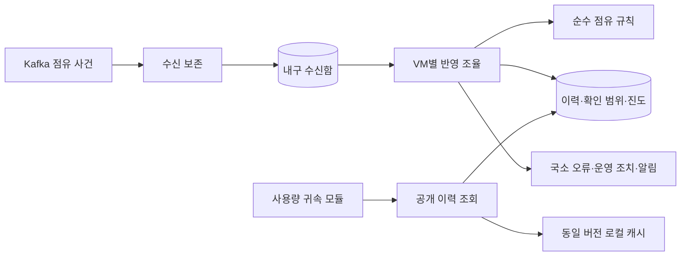

# 점유 이력 모듈 — 구현 인계

## 1. 결론과 범위

**승인된 7개 작업의 핵심 경로를 구현하고 로컬 검증했다. 시스템 전체 완료는 아니다.** 사용자 감독은 C3 책임·계약·모델·협력·검증 기준까지, C4 파일·클래스·메서드 표현은 에이전트 책임으로 둔다. 이 계획 이후 사용자의 별도 구현 승인을 받아 진행했다.

기준은 [HLD](occupancy-attribution-hld.md), [점유 LLD](occupancy-history-lld.md), [C3·구현자 참고](occupancy-history-code-design.md)다. 실행법·검증 범위는 [워커 README](../apps/occupancy-worker/README.md)에 기록했다.

## 2. 확정 구조

수신함과 이력은 같은 PostgreSQL이다. Kafka commit은 수신 보존, VM 트랜잭션 commit은 업무 반영이다. 공개 이력 조회는 귀속 모듈 내부 계약이며 고객 공개 API가 아니다. 조회 snapshot은 나중의 귀속 결과 공개까지 허가하는 토큰이 아니다.

핵심 패턴은 포트/어댑터, 명시적 서비스 조율, 불변 입력·판단 결과, 목적별 저장소, 내구 수신함과 버전 캐시다. 네 사건을 이유로 Strategy·State·Template Method 계층을 추가하지 않는다.

## 3. 점검 결과와 보완

| 확인한 빈틈 | 이번에 정한 대응 |
|---|---|
| 운영 재시도만으로 오류가 해제될 위험 | 실제 반영 성공과 해당 issue 해결을 같은 트랜잭션으로 처리. 충돌·과거 정정은 별도 경로까지 차단 |
| 누락 VM이 반복 선택돼 정상 VM이 밀림 | 재시도 시각·대기 순서·VM당 처리 상한. 앞 번호 도착 시 영속 재시도 예약 |
| 종료 때 미저장 offset 진행·재시작 누락 | 새 입력 중단·진행 DB 작업 정리·저장 범위만 commit. 강제 종료는 영속 상태에서 복구 |
| 워커 권한과 기존 BFF 계정 혼용 | 점유 업무 전용 실행 역할·별도 마이그레이션 역할, 실제 계정으로 금지 작업 검사 |
| 빈 이력·확인 부족·DB 장애 혼동 | 질의 결과 우선순위와 기술 실패 구분. DB 실패를 유휴/0원으로 해석하지 않음 |
| 실제 외부 발행자가 없어 검증 시작 불가 | 고정 점유 fixture로 초기화·종료·확인·재전달 재현. 실시간 인프라 구현으로 과장하지 않음 |

이 보완은 승인된 격리·복구 목표의 세부화다. 새 서비스·도메인 기능·외부 공급자는 도입하지 않았다.

## 4. 작은 구현 단위와 완료 조건

모든 단위는 필요한 실패 테스트 → 최소 구현 → 회귀 검증 순서로 진행한다. 앞 단위의 성공을 뒷단위 성공으로 확대하지 않는다.

| 순서 | 작업 단위 | 완료 증거 |
|---|---|---|
| 1 | 워커 최소 빌드·공개 경계와 CloudEvents 점유 계약 | 스키마·고정 예제·잘못된 입력·금지 의존의 실패/통과 기록. 기존 사용량 계약 회귀 |
| 2 | 초기화·시작·종료·확인의 순수 판단 | 손으로 정한 구간표·경계·중복·충돌 기대값과 일치. DB 없이 실행 |
| 3 | 수신함·이력·상태·오류 DB와 권한 | 신규 설치 및 재실행, PK/FK/중첩 제약, 실제 워커 계정 권한 검사 |
| 4 | VM별 반영·대기·운영 재시도 | 부분 실패 rollback, 동시 적용 한 번, A 누락/B 진행, 조치·해결 원자성 |
| 5 | 이력 조회·로컬 캐시 | 버전 혼합·늦은 cache put 방어, 유휴/미등록/확인 부족 구분, 조회의 상태 불변 |
| 6 | 실제 Kafka 수신·commit·복구 | DB commit 전후·commit 응답 유실·재시작·리밸런스, 원문 유실/업무 중복 반영 0건 |
| 7 | 영속 알림·운영 포트와 전체 모듈 연결 | 테스트 알림 수신기에서 실패·중복 재전달, 신뢰 운영 문맥과 무권한 거부. 실제 외부 연결은 별도 표시 |

주요 각 단위에서 한 번에 처리하는 수·지연·DB 읽기·캐시 적중·대기 연령을 기록한다. 수치를 미리 성능 달성으로 선언하지 않는다. 기능별 커밋에는 검사 범위·미검증 범위를 남기고 작업 중 사용자에게 파일 승인 대신 결과·다음 경계를 보고한다.

## 5. 남은 과제 — 이번 모듈과 분리

| 남은 범위 | 시작을 막는가? / 완료 조건 |
|---|---|
| 귀속 결과의 공개·정정 경합 | 점유 모듈 기본 구현은 가능. 고객 공개·과거 정정 활성화 전에는 반드시 해결해야 함 |
| 실제 운영 인증·알림 채널 | 포트·통합 테스트는 가능. 실제 사용자 개입까지 완료했다고 하려면 실행 환경의 권한·전달 연결 필요. 인증 없는 관리 HTTP API는 열지 않음 |
| 실시간 외부 점유 발행자의 번호 보존 | fixture 검증은 가능. 실제 인프라 연동 보장에는 별도 구현 필요 |
| 월·가격 경계, 부분 결과와 월 확정, 가격 동기화 | 비용·정산 모듈 설계 과제. 점유 조회가 대신 정책을 결정하지 않음 |
| 장기 보관·디스크 손실·운영 TLS·대규모 성능 | 운영 완료의 조건. 로컬 기능·프로세스 장애 테스트로 대체하지 않음 |

최소 완료 시연은 **두 VM의 점유 사건 재생 → 한 VM 오류 격리 → 다른 VM 계속 반영 → 종료/재시작 → 동일 이력 조회 → 원인 해소 후 재처리**다. 회사별 비용 대시보드 전체 완성을 뜻하지 않는다.

## 6. 감독·인계 규칙

사용자에게 설명할 때는 레이어 → 역할별 구성요소 → 패턴 선택까지 한 단계씩 확대한다. 파일·타입은 요청 시에만 보여주며 C4 표현 선택은 에이전트가 수행한다. 구현 중 계약·소유권·안전성 변경이 필요하면 근거와 영향을 제시하고 C3로 돌아간다. 단순 리팩터링·동일 계약의 표현 변경은 반복 승인을 요구하지 않는다.

2026-09-26: 계약·규칙·DB·Kafka·별도 JVM 강제 종료/재시작과 인증된 3브로커 로컬 연결 검사를 통과했다. 기존 PostgreSQL 접근·ClickHouse 저장·사용량 수집 회귀 검사도 통과했다. 실제 운영 인증·외부 알림·귀속 공개·월 정산은 미완료다.
