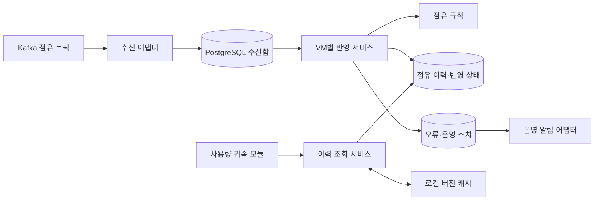

# 점유 이력 모듈 LLD

## 1. 상태·범위

점유 이력 모듈의 구현 계획 기준. **내구 수신함 뒤 commit·VM별 적용 트랜잭션·DB 버전 확인 기반 로컬 캐시는 승인된 결정**이다. 공개 인터페이스 → 입력·상태 공간/오라클 → 내부 책임·협력 → 패턴 순으로 정리했다. 사용자 감독 범위는 C3까지이며 C4 파일·타입 표현은 에이전트가 담당한다. 제품 코드·DDL·자동 테스트는 아직 없다. [구현 준비·남은 범위](occupancy-history-implementation-plan.md), [HLD](occupancy-attribution-hld.md), [기존 이벤트 계약](event-contract.md)을 따른다.

입구는 점유 사건 수신, 출구는 동일 버전의 점유 이력·확인 범위다. 사용량 귀속·가격 계산·BFF·월간 확정은 이 모듈이 소유하지 않는다. VM 제어와 발행자의 미전송 사실 보존도 외부 책임이다.

**승인된 변경:** ADR-009의 ‘이력·캐시 반영 후 Kafka commit’을 ‘PostgreSQL 수신함 내구 저장 후 commit’으로 대체한다. 수신 보존과 업무 반영을 분리하며 기존 사용량 토픽과 ClickHouse 소비 기준은 변경하지 않는다.

## 2. 외부·내부 계약

### 이벤트

CloudEvents Structured JSON을 유지한다. `specversion=1.0`, `source`는 기존 VM 출처, `subject=instances/{ResourceId}`, `id`는 재전송 때 유지하는 UUID다. `source+id`가 사건 식별자이며 Kafka key는 `source`다. VM 출처와 subject의 등록 관계는 초기 등록 후 불변이다. `time`은 실제 사건 시각이며 수신 시각으로 대체하지 않는다.

`type`은 `io.github.bbororo5.cloudusage.instance.occupancy.` 뒤에 아래 값을 붙인다. `datacontenttype=application/json`; `dataschema`는 구현 시 추가할 `contracts/v1/instance-occupancy-event.schema.json`의 저장소 절대 URI를 사용한다. 현재 사용량 스키마를 수정하지 않는다.

| type 접미사 | data의 필수 필드 | 조건 |
|---|---|---|
| `initialized.v1` | `sequence`, `baselineAt`, `initialOccupancy` | sequence=1. 초기 점유는 null 또는 occupancyId·billingAccountId·startedAt. startedAt ≤ baselineAt ≤ time |
| `started.v1` | `sequence`, `occupancyId`, `billingAccountId` | 실제 시작은 time. 대상 회사는 기존 회사 원장에 존재해야 함 |
| `ended.v1` | `sequence`, `occupancyId` | 실제 종료는 time. 지정 점유만 종료 |
| `confirmed.v1` | `sequence`, `confirmedThrough` | confirmedThrough ≤ time. 이전 확인 시각보다 작을 수 없음 |

sequence는 JSON 정수 1..9223372036854775807, Java long/PostgreSQL bigint다. 초기 등록부터 VM별로 1씩 증가하며 재시작·회사 변경 시 초기화하지 않는다. occupancyId는 VM 내 새 점유마다 새 UUID, 회사 식별자는 기존 billing_account_id와 같은 비어 있지 않은 문자열이다. 시간을 Java Instant로 정규화하고 기존 입력과 같은 최대 밀리초 정밀도를 검증한다. 초과 정밀도를 DB에서 반올림해 수용하지 않는다.

새 점유 스키마는 위 필드만 허용한다. 실제 달력 유효성, 필드 간 시간 비교·번호 연속성·DB 관계는 JSON Schema 검사와 별도로 검증한다. 포맷 검사만으로 전체 계약을 보장하지 않는다. 이 프로젝트 data 필드는 CloudEvents/FOCUS 표준 필드가 아니다.

### 공개 계약과 내부 실행 계약

**귀속 모듈에 공개하는 것은 HistoryReader뿐**이다. 운영 재시도는 별도 운영 포트이며 수신·반영 실행은 다른 업무 모듈에 공개하지 않는다.

```text
Kafka ── CloudEvents ──→ [점유 이력 모듈] ←─ HistoryReader ── 귀속 모듈
운영 어댑터 ── IssueRetry ──→     │
                       내부 실행: receive / applyNext
```

| 호출 경계 | 구체 계약 | 보장·호출자 책임 |
|---|---|---|
| 귀속 → HistoryReader | `lookup(HistoryQuery) → HistoryResult` | 읽기 전용·상태 변경 없음. 이력/확인 범위는 같은 버전. 귀속·공개 허가는 반환하지 않음 |
| 운영 → IssueRetry | `retry(RetryIssueCommand, OperatorContext) → RetryResult` | 호출자의 운영 권한을 검증하고 재검토만 예약. 고객 역할로 호출 불가 |
| Kafka 어댑터 → 내부 수신 | `receive(ReceivedRecord) → DurableReceipt` | DB 내구 저장 후 반환. commit은 Kafka 어댑터 책임 |
| 실행 어댑터 → 내부 반영 | `applyNext(VmSource) → ApplyResult` | VM별 원자적 반영. 다른 모듈은 호출하지 않음 |

HistoryQuery는 `VmSource`와 `TimeRange(Instant from, Instant to)`이며 from < to를 생성 시 검사한다. HistoryResult는 `Confirmed(HistorySnapshot)`, `NotReady(reason)`, `Conflict(issueId)`의 닫힌 결과 타입이다. NotReady 사유는 UNREGISTERED / BEFORE_BASELINE / AWAITING_FACTS, 기술 장애는 `HistoryUnavailable`로 구분한다. 유효하지 않은 입력은 `InvalidQuery`이며 빈 이력으로 돌려주지 않는다.

HistorySnapshot은 source·subject·baselineAt·confirmedThrough·version과 불변 `OccupancySlice(occupancyId,billingAccountId,startedAt,endedAt)` 목록이다. 목록은 시작 시각·점유 ID 순으로 정렬하고 요청 구간에 걸친 이력을 반환한다. endedAt만 미종료일 때 비어 있을 수 있다. 회사·과거 이력을 다루므로 내부 워커 전용이며 고객 BFF에는 노출하지 않는다.

RetryIssueCommand는 requestId·issueId·reason이다. OperatorContext는 클라이언트가 전달한 역할 문자열이 아닌 신뢰된 실행 경계에서 만든 운영 주체다. 결과는 `Scheduled`, `AlreadyScheduled`, `Rejected(reason)`이다. 같은 requestId 재요청은 동일 결과를 반환하고, 다른 내용으로 재사용하면 거부한다. 거부 사유는 FORBIDDEN / NOT_FOUND / ALREADY_RESOLVED / INVALID_REQUEST다. DB 장애는 기술 실패로 남겨 같은 requestId로 재시도한다. 운영 권한은 기존 고객 RBAC 역할에 추가하지 않는다.

```text
내부 ReceivedRecord = topic / partition / offset / key / headers / rawBytes
내부 ApplyResult = Applied(version) / Idle / Waiting(reason) / Blocked(issueId)
```

Kafka 라이브러리의 ConsumerRecord를 api/domain에 넘기지 않는다. 사건이 아직 없으면 Idle, 후속 번호만 있어 앞이 비면 Waiting이다. 다음 version/sequence의 정수 상한 도달 시 wraparound하지 않고 오류로 보류한다.

snapshot은 VM 출처·subject·기준 시각·확인 완료 시각·version·겹치는 점유 구간 목록을 포함한다. from < to인 구간만 허용하며 기준 이전·확인 범위 초과는 NotReady다. 확인된 유휴 구간은 Confirmed와 빈 목록으로 반환한다. DB 장애는 StorageUnavailable 예외로 구분하고 빈 이력으로 위장하지 않는다. 이미 반영된 동일 사건은 기존 결과를 재사용한다.

`retryIssue`는 원본을 수정하거나 오류를 해결 완료로 바꾸지 않는다. 고객 Admin/Viewer가 아닌 내부 운영 주체만 호출하며 사유를 기록한다. 실제 이력 정정은 귀속 공개 차단과 연동해야 하므로 이 포트에서 임의 수정하지 않는다.

## 3. 입력·상태 공간과 테스트 오라클

### 먼저 정하는 관찰 가능한 기준

내부 클래스를 가정하기 전에 Kafka 입력, HistoryReader 응답, 운영 요청 결과와 영속 상태를 기준으로 나눈다. 기준 이력은 VM A가 10:00–10:02 회사 X, 10:02–10:04 회사 Y에 점유되고 기준 시각 10:00·확인 끝 10:04인 고정 데이터다.

| 독립적인 기준 질의 | 기대 결과 |
|---|---|
| `[10:01,10:02)` | Confirmed, X 구간 하나 |
| `[10:02,10:03)` | Confirmed, Y 구간 하나 |
| `[10:01,10:03)` | Confirmed, X·Y 두 구간. 이 모듈이 임의 분할 과금·한 회사 귀속하지 않음 |
| `[10:03,10:04)` / `[10:03,10:04.001)` | 각각 Confirmed / NotReady(AWAITING_FACTS) |
| 시작이 10:00 이전 / 시작=종료 | 각각 NotReady(BEFORE_BASELINE) / InvalidQuery |
| 확인된 별도 유휴 VM / 미등록 VM | 각각 Confirmed+빈 목록 / NotReady(UNREGISTERED) |

상태 축은 미등록·초기화·점유·유휴, 처리 축은 수신·대기·적용·오류, 전달 축은 정상·중복·역순·누락·충돌, 장애 축은 각 내구 기록 전후다. 구간 축은 기준/확인 끝의 직전·동일·직후다. 이 축을 아래 대표 위험 조합으로 제한한다.

전 조합을 곱하지 않는다. 금전·격리 위험의 핵심 경계와 각 commit 앞뒤 중단을 우선하고, 순서·재전송 조합은 고정 seed의 작은 이력으로 생성한다. 실제 운영 크기의 부하는 별도 측정한다.

| 분할 축·대표 사례 | 기대 결과·오라클 | 최소 검증 수준 |
|---|---|---|
| 4종 사건, 필수 누락·타입·sequence 범위·잘못된 날짜·초과 소수 초 | 유효 예제 수용, 위반은 원문 보존·반영 거부. 기존 사용량 스키마 불변 | 계약 테스트 |
| 초기 유휴/점유, 정상 시작→종료, baseline 이전 조회 | 손으로 작성한 회사·구간 기대표; 기준 이전 NotReady | 순수 단위 |
| 확인 끝 직전/동일/초과, 유휴·하나·여러 인접 점유 | `[a,b)` 경계 기대값, 확인된 빈 목록과 미확인을 구분 | 순수 단위 |
| 동일 재전송, JSON 키 순서만 변경, 같은 ID/번호의 내용 충돌 | 이력·version 불변 또는 오류. 비교 로직과 별도로 예상 행 수·구간을 검사 | 단위 + PostgreSQL |
| 번호 누락·역순·재시작 | 누락 앞에서 last_applied 정지, 사실 복구 후 정상 순서 실행과 같은 결과 | PostgreSQL |
| A 누락·B 정상, 같은 Kafka 파티션 | A만 대기하고 B 반영·조회 성공. 전역 중단 0건 | Kafka + PostgreSQL |
| 열린 점유 중 새 시작, 잘못된 점유 종료, 미등록 회사 | 원본 보존·ERROR·issue, 정상 이력 변경 0건 | PostgreSQL 제약 |
| 확인 과거 변경, 이전 점유 종료의 재전달 | 과거 덮어쓰기·새 점유 종료 0건. 동일 재전달은 무변경 | 단위 + PostgreSQL |
| DB 수신 commit 전/후, Kafka commit 실패·리밸런스 | 재시작 후 모든 전달 원문 보존, 정규 사건·반영은 한 번 | 실제 Kafka + PostgreSQL |
| 구간 쓰기 후 상태 갱신 전 중단, 두 반영자 경합 | 트랜잭션 전체 rollback 또는 일괄 성공, 한 sequence는 한 번 적용 | 실제 PostgreSQL 두 연결 |
| cache hit/miss/eviction, 옛 snapshot의 늦은 cache put | 언제나 요청 version의 구간·확인 범위 일치; DB 장애를 빈 이력으로 반환하지 않음 | 단위 + PostgreSQL |
| 오류 생성과 조회 동시 실행 | DB 스냅샷 기준 일관된 응답. 이후 공개 안전성은 이 테스트의 보장 밖 | PostgreSQL 동기화 지점 |
| 알림 실패·중복, 운영자 재시도, 고객 역할의 호출 | 오류 보존·재전달·감사 기록, 무권한 조치 0건, 확인만으로 해결 0건 | 어댑터 단위 + 접근 통합 |
| 같은 운영 requestId 재전송·내용 변경, 예약 성공 뒤 응답 유실 | 감사·예약 중복 없음, 같은 결과 재사용, 내용 변경 거부 | 공개 계약 + PostgreSQL |
| 적용할 사건 없음 / 다음 번호 누락 / version·sequence 상한 | Idle / Waiting / 안전한 보류. 무한 증가·wraparound 없음 | 단위 + 저장 검증 |
| 오류 조치 후 재실패 / 성공 / 다른 오류 잔존 | 실패 시 OPEN 유지, 성공 시 반영과 해당 오류 해결을 원자 기록, 다른 오류는 유지 | 실제 PostgreSQL |
| 장기 대기 A와 연속 입력 B, 종료 중 저장 실패 | 공정한 재시도로 B 진행, 미저장 위치 commit 0건, 재시작 후 수신함부터 복구 | Kafka·PostgreSQL |
| 실제 워커 DB 계정으로 원장 쓰기·고객 데이터 변경 | 점유 업무 허용, 소속·역할·가격·정산 쓰기 및 DDL 거부 | DB 접근 통합 |

저비용 오라클은 고정 구간 기대표, DB 행·제약·진도, 입력 중복 전후 결과 불변을 사용한다. 구현의 규칙 함수를 다시 호출해 기대값을 만들지 않는다. 실제 DB 통합은 잠금·격리·제약·rollback에만, 실제 Kafka는 commit·재전달·파티션 격리에 집중한다. 캐시·Kafka mock 통과를 실제 장애 검증으로 확대하지 않는다.

**검증 순서:** 외부 계약의 기대값을 먼저 고정 → 내부 분해 후 순수 규칙 단위 테스트로 빠르게 반복 → DB·Kafka로 각 경계 보장 확인. 단위 테스트가 끝났다는 이유로 공개 포트 통합 검증을 생략하지 않는다. 장애 테스트는 sleep 대신 latch/barrier 등 명시적인 중단 지점을 사용한다.

## 4. 모듈 구조와 패턴

구성요소 관점의 [C3·파일·메서드·종료 사건 의사코드](occupancy-history-code-design.md)에 아래 구조를 구체화했다. 승인된 동작을 바꾸지 않는 코드 설계 검토안이며 구현은 아니다.



모두 승인된 워커 프로세스 내부 구성요소다. DB 상자는 같은 PostgreSQL의 데이터 구분이며 새 DB·서버가 아니다.

| 구성요소 | 책임·선택 이유 |
|---|---|
| 수신 어댑터 | Kafka 레코드를 원문 그대로 수신함에 보존하고 저장 완료 위치만 commit한다. 업무 규칙과 분리한다. |
| 반영 서비스 | VM별 직렬 처리, 트랜잭션, 재시도 조율. 포트 뒤의 저장소를 사용한다. |
| 점유 규칙 | 등록·시작·종료·확인의 유효성 및 새 상태 계산. DB·Kafka·캐시에 의존하지 않아 단위 테스트가 쉽다. |
| 이력 조회 서비스 | 이력·확인 범위·차단 상태의 일관된 스냅샷을 반환한다. 캐시는 이 서비스 밖으로 노출하지 않는다. |
| 운영 알림 어댑터 | 영속 오류를 전달하고 전달 결과를 기록한다. 점유 원장을 수정할 권한은 없다. |

### 코드 경계와 의존 방향

```text
occupancyhistory/
  api/             HistoryReader, IssueRetry, 공개 입력·결과 타입
  application/     ReceiptService, ApplyService, QueryService, RetryService
  domain/          OccupancyRules, Event, HistoryState, ApplyDecision
  port/            ReceiptStore, HistoryStore, SnapshotStore, IssueStore,
                   SnapshotCache, TransactionRunner, AlertSender
  adapter/         kafka/, postgres/, cache/, operations/, notification/
```

이는 워커 안의 패키지 구분이며 패키지마다 Gradle 모듈·서비스를 만들지 않는다. api는 내부 서비스·SQL·Kafka 타입을 노출하지 않는다. 외부 귀속 코드는 api만 참조하고 application/domain/port/adapter를 직접 참조하지 않는다.

```text
외부 귀속 코드 → api ← application → domain
                          ↓
                         port ← adapter 구현
수신·주기실행 어댑터 → application
```

domain은 JDK 값 타입만 사용한다. application은 domain·port·api를 알지만 Kafka/Spring/SQL 구현에는 의존하지 않는다. 워커의 구성 지점이 구현체를 주입한다. 포트는 테이블별 CRUD가 아니라 ‘수신 보존’, ‘잠금 아래 다음 사건과 이력 읽기’, ‘반영 변경 묶음 저장’처럼 일관성 경계에 맞춘다.

### 협력과 트랜잭션 배치

| 흐름 | 협력 | 트랜잭션·실패 책임 |
|---|---|---|
| 수신 | Kafka 어댑터 → ReceiptService → ReceiptStore | 서비스가 TransactionRunner로 레코드 보존 트랜잭션 실행. 성공 반환 뒤 어댑터만 Kafka commit. DB 실패면 commit 금지 |
| 반영 | 실행 어댑터 → ApplyService → HistoryStore → OccupancyRules → 저장 | 서비스가 VM 잠금·업무 원자성 조율. 규칙은 변경안 또는 대기/오류를 반환할 뿐 DB를 쓰지 않음 |
| 조회 | HistoryReader → QueryService → SnapshotStore + SnapshotCache | REPEATABLE READ 범위 안에서 버전·차단 확인 후 cache hit/miss 처리. 캐시 실패는 같은 DB 스냅샷으로 대체 |
| 운영 재시도 | 운영 어댑터 → IssueRetry → RetryService → IssueStore | 신뢰된 운영 권한 확인 뒤 예약·감사 기록을 한 트랜잭션으로 저장. issue 해결로 간주하지 않음 |
| 알림 | 알림 실행 어댑터 → IssueStore → AlertSender | 전송은 DB 트랜잭션 밖, 실패는 영속 재시도. 업무 반영 rollback과 결합하지 않음 |

실행 어댑터는 DB 트랜잭션을 잡은 채 backoff하지 않는다. 일시 저장 장애는 호출자에게 기술 실패로 전달하고 다음 실행에서 재시도한다. 업무 모순은 영속 issue로 남긴다. 정상 규칙 오류를 SQL 예외에만 맡기지 않되 DB 제약은 마지막 방어로 유지한다.

### 필요한 패턴만 선택

| 선택 | 해결하는 문제 | 적용 한계 |
|---|---|---|
| Port/Adapter | Kafka·DB·알림을 도메인 규칙에서 분리하고 실제 의존 경계를 테스트 | 작은 포트만 정의. 모든 클래스에 대응 인터페이스를 만들지 않음 |
| Repository + TransactionRunner | 저장 접근과 트랜잭션 구현을 분리하되 서비스가 작업 원자성을 명시 | 테이블마다 범용 CRUD 저장소·추가 UnitOfWork 계층을 만들지 않음 |
| 순수 규칙 함수 | 동일한 사건·이력 상태에 동일한 변경안을 산출 | 불변 record와 sealed 결과 타입 사용. 도메인에 I/O·현재 시각 의존을 넣지 않음 |
| Durable Inbox | Kafka 수신 보존과 VM별 업무 적용을 분리 | 일반적인 Event Sourcing 시스템으로 확장하지 않음 |
| 버전 키 기반 cache-aside | 캐시 손실·늦은 쓰기에도 같은 DB 버전의 결과 제공 | 작은 DB 상태 조회 비용은 남음. 별도 캐시 서버 없음 |

네 사건은 명시적인 분기로 처리한다. 사건별 Strategy 클래스·범용 State 프레임워크는 도입하지 않는다. 최초 구현은 워커 한 인스턴스·반영 루프 하나로 시작하되 DB의 VM 잠금으로 동시 실행도 방어한다.

## 5. 데이터 모델·제약

```text
수신 레코드 N ──→ 정규 사건 1 ──→ VM 반영 상태 1 ──→ 점유 구간 N
      │                │                │
      └──────────── 오류·운영 조치 ──────┘
```

테이블명은 설계명이다. PostgreSQL 원장은 캐시와 무관하게 재구축 가능한 진도를 보존한다.

| 테이블 | 키·핵심 필드 | 제약·읽기 경로 |
|---|---|---|
| `occupancy_receipt` | PK(topic, partition, offset); 원문 bytea·key·headers·수신 시각·파싱 결과·관련 사건 | 재전달 원문 보존. 같은 Kafka 위치는 한 번만 저장. 다른 위치의 충돌 내용도 잃지 않음 |
| `occupancy_event` | PK(source,id); sequence·type·정규화 내용·상태·사유·next_retry_at | UNIQUE(source,sequence). sequence>0. 사건 상태별 재시도 인덱스 |
| `occupancy_stream` | PK(source); subject·baseline_at·initialized·last_applied_sequence·confirmed_through·version | 미등록 수신도 잠금용 행 생성 가능. 초기화 전 baseline/확인은 null, 적용 위치 0. 확인 시각 ≥ 기준 시각 |
| `occupancy_interval` | PK(source,occupancy_id); billing_account_id·started_at·ended_at·changed_version | 회사·VM FK. ended_at > started_at 또는 null. VM별 `[시작,종료)` 중첩 금지 |
| `occupancy_issue` | issue_id·source(불명 가능)·구간·receipt 참조·사유·OPEN/RESOLVED·알림 상태 | dedup_key UNIQUE로 같은 원인의 알림 묶음. 정상 이력 테이블에는 모순 행을 넣지 않음 |
| `occupancy_issue_action` | action_id·request_id·issue_id·운영 주체·사유·결과·시각 | request_id UNIQUE. 추가 전용. 같은 요청 결과 재사용, 내용 충돌 거부 |

원본 수신함에는 회사 FK를 강제하지 않는다. 알 수 없는 회사도 수신·오류 보존해야 하기 때문이다. 정규 이력에는 FK를 적용한다. 시간은 timestamptz(3), version/sequence는 bigint다. 점유 중첩은 btree_gist와 `EXCLUDE USING gist (source WITH =, tstzrange(started_at,ended_at,'[)') WITH &&)`로 DB에서도 막는다. 인접 구간은 허용하고 종료 null은 열린 끝으로 취급한다. 확장 설치 권한은 DB 마이그레이션 역할만 갖는다.

동일 source+id 또는 source+sequence에 다른 내용이 오면 정규 사건을 덮어쓰지 않는다. 두 receipt를 보존하고 오류를 연다. JSON 키 순서나 같은 순간의 시간 표기는 정규화 후 전체 필드로 비교한다. 해시는 검색 보조일 뿐 같음을 판정하는 유일한 근거가 아니다.

## 6. 상태·트랜잭션·복구

### 수신과 반영을 분리하는 이유 — 승인된 변경

VM A의 11번 대신 12번이 먼저 들어왔을 때, 12번 반영을 기다리며 소비를 멈추면 뒤의 11번과 VM B 입력까지 막힐 수 있다. 따라서 업무 오류를 Kafka 파티션 대기로 처리하지 않고 영속 수신함에서 VM별로 대기시킨다.

```text
Kafka poll → 수신함 DB commit → 해당 파티션의 저장 완료 위치 commit
                  ↓
            VM별 반영 재시도 → 이력·확인 범위 DB commit → 조회 가능
```

- 수신 루프는 auto commit을 끄고 원문을 제한된 묶음으로 DB에 저장한다. Kafka commit은 실제 읽은 레코드 중 저장 완료한 연속 범위의 다음 위치다. Kafka offset 숫자가 항상 연속이라고 가정하지 않는다. 미저장 레코드를 건너뛰지 않는다.
- 최초 구현의 DB 수신 트랜잭션은 레코드별이다. 원문 receipt와 파싱 가능한 정규 event 또는 오류 issue를 함께 commit한다. 알려진 VM은 stream 행을 먼저 생성·잠근 뒤 식별자 중복을 검사한다. 반영·오류 처리도 같은 잠금 순서를 따라 내용 충돌과 동시 적용을 직렬화한다. 유효성 실패로 원문 보존까지 rollback하지 않도록 savepoint로 구분한다.
- DB commit 전 장애는 Kafka 재전달, DB commit 후 Kafka commit 실패는 중복 receipt로 흡수한다. 리밸런스 시 실패한 commit을 성공 처리하지 않는다. Consumer 조작은 수신 스레드만 담당한다.
- 파싱 오류·key/source 불일치도 원문·오류를 내구 저장한다. source가 불명확하면 회사나 VM을 추측하지 않는다. 운영 경고를 남기며 올바른 입력만 업무 반영한다. 기존 사용량의 신뢰·직접 소비 정책은 유지한다.
- DB 불가·용량 부족은 내구 저장이 불가능하므로 소비 진행을 막는다. 이 공통 인프라 장애까지 VM별 격리한다고 주장하지 않는다. 수신함 적체·Kafka 보관 한도에 경고를 건다.

### VM별 적용

반영 서비스는 짧은 트랜잭션에서 stream 행을 `SELECT FOR UPDATE`로 잠그고 예상 번호 `last_applied_sequence+1`을 검사한다. 초기 행 생성 경합은 PK로 합친다. 정상 사건은 규칙 검증 → 구간 변경 → version·연속 위치·확인 범위 갱신 → 사건 APPLIED를 **같은 트랜잭션**으로 commit한다. 캐시·알림 네트워크 호출은 이 트랜잭션에 넣지 않는다.

```text
RECEIVED ──정상──→ APPLIED
    ├─선행 사실 부족──→ WAITING ──누락 사실 반영──→ 재시도
    └─모순·충돌──────→ ERROR ──운영자 조치────→ 재검토
```

sequence가 비면 해당 VM만 기다리고 다음 VM을 처리한다. 일시 DB 오류는 rollback 후 재시도하며 영구 오류로 분류하지 않는다. FK·중첩 위반은 savepoint로 업무 변경만 되돌리고 사건 ERROR·issue를 기록한다. 오류 사건의 sequence를 적용 완료로 건너뛰지 않는다. 각 VM의 시도는 제한된 수의 사건으로 끝내며 재시도 간격은 1초부터 최대 30초의 backoff와 jitter를 사용한다. 주기적 DB 탐색이 복구 근거이며 메모리 알림은 가속 수단이다.

초기 등록은 실제 시작 시각을 보존하면서 confirmedThrough=baselineAt으로 시작한다. 시작·종료의 실제 시각이 이미 확인된 끝보다 앞서면 일반 사건으로 과거를 바꾸지 않고 오류 처리한다. 종료가 없는데 새 점유가 시작되거나 대상이 다른 종료도 오류다. 완료 확인은 연속 번호까지 모두 반영했을 때만 전진한다. 이미 처리한 번호가 다시 와도 version을 올리지 않는다.

### 캐시·조회

최초안은 **크기 제한이 있는 프로세스 로컬 캐시**이며 별도 서버를 추가하지 않는다. 키는 `(source, version, from, to)`이고 값은 불변 조회 스냅샷이다. 제품 선택은 성능 측정 뒤로 미루되 최대 엔트리 수를 설정으로 제한한다. 캐시를 잃어도 정확성은 변하지 않아야 한다.

조회는 짧은 PostgreSQL REPEATABLE READ 읽기 전용 트랜잭션에서 stream의 version·확인 범위와 관련 OPEN issue를 먼저 읽는다. 같은 version·구간의 캐시만 사용하고, miss면 같은 DB 스냅샷으로 점유 구간을 읽는다. 늦은 캐시 쓰기는 옛 version 키에만 저장돼 최신 결과를 덮어쓰지 못한다. 오류 범위가 불명이지만 VM은 알면 해당 VM의 조회를 보수적으로 막는다. 알려진 오류 구간과 무관한 과거는 제공할 수 있다.

이를 위해 VM별 version은 초기 반영·정정·차단 상태 변경 등 조회 결과에 영향을 주는 모든 변경에서 증가한다. VM 상태 행을 잠그는 규칙은 오류 생성·해결에도 적용한다. 캐시는 조회마다 읽는 작은 상태 행을 없애지는 못한다. 여러 사용량의 같은 VM 질의를 묶어 한 스냅샷으로 처리하고, 비용·효과는 측정한다. TTL만으로 최신성을 판단하지 않는다.

**조회 스냅샷은 이후 공개를 허가하는 영구 토큰이 아니다.** 조회 뒤 발생한 이력 정정과 실제 귀속 공개의 경합은 귀속 모듈 LLD의 필수 연결 과제다. 그 절차가 구현되기 전 운영자의 임의 과거 정정은 허용하지 않는다. 이 모듈은 version과 차단 상태를 제공하고 정정 완료를 가장하지 않는다.

### 사람 개입과 운영

오류 기록을 알림 작업의 영속 근거로 사용한다. 전달 실패는 재시도하고 issueId로 중복 알림을 묶는다. 전송 후 전달 상태 기록 전 장애는 중복 알림 가능하므로 exactly-once 알림을 주장하지 않는다. 알림 수신자는 고객이 아니라 내부 운영자다. 미등록 회사 등록·외부 누락 사실 재전송 후 재시도는 가능하나, 충돌 원문을 조용히 덮어쓰거나 번호를 건너뛰는 해결은 금지한다. 권한 있는 운영자의 정정 워크플로는 후속 귀속 공개 계약과 연결한다.

Kafka lag와 별도로 수신함 미반영 수·최장 대기 시간·VM 확인 시각 지연·미전달 알림·DB 용량을 관측한다. 수신함을 둔 뒤 lag 0을 업무 완료로 간주하면 안 된다. 미해결 receipt·event·issue는 자동 삭제하지 않는다. 보관·아카이브 정책은 운영 검증 과제로 남긴다.

### 구현 준비 점검에서 보완한 경계

- **오류 해제:** 운영 재시도는 해당 사건을 재검토 가능하게 할 뿐 OPEN issue를 닫지 않는다. 원인 해소 후 사건 반영·진도 갱신·해당 issue 해결·감사 기록을 한 VM 트랜잭션으로 기록한다. 다른 OPEN issue는 그대로 둔다. 본문 충돌·확인된 과거 정정은 단순 재시도로 해제하지 않고 후속 정정 절차까지 차단한다.
- **대기와 공정성:** 적용 후보는 next_retry_at이 지난 VM을 오래 기다린 순으로 제한해 선택하고, VM당 반영 건수에도 상한을 둔다. 누락된 앞 번호 도착 시 대기 VM을 즉시 재검토 가능하게 하되 영속 상태가 기준이다. 누락은 WAITING, 확인된 모순은 ERROR이며 장기 WAITING도 중복 억제된 운영 알림 대상이다. 구체 상한·알림 지연은 설정값으로 두고 실측 조정한다.
- **시작·종료:** DB 마이그레이션·필수 제약·권한 확인 실패 시 소비를 시작하지 않는다. 종료는 새 poll/업무 예약 중단 → 진행 DB 작업 완료 또는 rollback → 저장 완료 범위만 Kafka commit → 연결 종료 순이다. 강제 종료도 같은 수신함 재전달·VM 트랜잭션 규칙으로 복구한다. 업무 준비 상태와 Kafka 연결 상태는 별도로 표시한다.
- **저장 완료:** 수신함 성공은 메모리 큐 적재가 아니라 PostgreSQL 내구 commit이다. 배포 설정에서 WAL·동기 commit의 내구 조건을 확인하고, 프로세스 종료 시험만으로 전원·디스크 영구 장애까지 보장하지 않는다. 미저장 입력을 skip하거나 DB 불가 시 메모리 성공으로 대체하지 않는다.
- **최소 권한:** 워커 전용 DB 역할은 점유 수신·이력·진도·issue·감사 데이터만 업무상 읽고 변경한다. 회사 식별자는 회사 원장의 ID만 제한된 읽기 인터페이스로 확인한다. 사용자·세션·소속·역할·가격·월 확정 변경, DDL, superuser/BYPASSRLS는 금지한다. 마이그레이션 역할과 실행 역할을 분리한다. 귀속 모듈용 ClickHouse 권한은 다음 모듈 설계에서 추가한다.
- **오류 응답 우선순위:** 잘못된 질의는 InvalidQuery, 저장소 불가는 HistoryUnavailable이다. 정상 질의에서 미등록이면 NotReady, 등록 VM의 관련 OPEN 모순이면 Conflict, 나머지 확인 부족은 NotReady, 확인된 유휴만 빈 Confirmed다. 원본·회사 상세·SQL 예외를 고객 응답이나 공용 로그로 노출하지 않는다.
- **재현 가능한 입력:** 초기 계약·통합 테스트는 번호·사건 ID·시각이 고정된 점유 fixture를 반복 발행한다. 외부 실시간 발행자의 번호 영속화까지 구현한 것으로 간주하지 않는다. 새 VM 초기 등록은 fixture에 명시하며 재시작 때 새 등록 사건을 임의 생성하지 않는다.

## 7. 승인 범위와 다음 작업

승인한 핵심은 **내구 수신함 뒤 commit**, **VM별 적용 트랜잭션**, **DB 버전을 확인하는 로컬 캐시**다. ADR-009·저장소 계약의 점유 소비 완료 기준을 갱신했다. 귀속 공개·정정의 연결 설계나 제품 구현 전체를 승인한 것으로 확대하지 않는다.

**점유 이력 모듈의 핵심 경로는 구현 계획 수립 가능**하다. [실행 계획](occupancy-history-implementation-plan.md)의 작은 단위로 계약·실패 테스트부터 진행한다. C4 파일명·타입·메서드마다 사용자 승인을 반복하지 않되 외부 계약·데이터 소유권·격리·내구성·공개 조건의 변경은 C3 재검토 대상이다. 이번 설계 정리는 제품 구현 명령으로 간주하지 않는다.

미완료 연결 과제는 귀속 공개·정정 경합, 실제 운영 인증·알림 채널, 전체 월 정산이다. 이 모듈은 신뢰된 운영 문맥·알림 포트를 정의하고 무권한·실패를 검사하지만 외부 연결 구현까지 완료했다고 주장하지 않는다. 구조 검사는 `외부 귀속 → api만`, `domain → JDK만`, `application → adapter 참조 금지`를 검사하도록 기존 모듈 경계 테스트를 확장한다.

## 근거

- [CloudEvents 1.0.2](https://github.com/cloudevents/spec/blob/v1.0.2/cloudevents/spec.md): 기존 외형·source/id 의미를 재사용한다. 점유 data는 프로젝트 계약이다.
- [KafkaConsumer 4.3](https://kafka.apache.org/43/javadoc/org/apache/kafka/clients/consumer/KafkaConsumer.html): 수동 commit·DB 저장 후 재전달·파티션별 처리 위치의 근거. 수신함 채택 자체는 프로젝트 판단이다.
- [PostgreSQL 제약](https://www.postgresql.org/docs/current/ddl-constraints.html), [명시적 잠금](https://www.postgresql.org/docs/current/explicit-locking.html): 중첩 제약과 VM 행 잠금의 근거. 적용 버전의 DB 통합 테스트로 검증한다.
